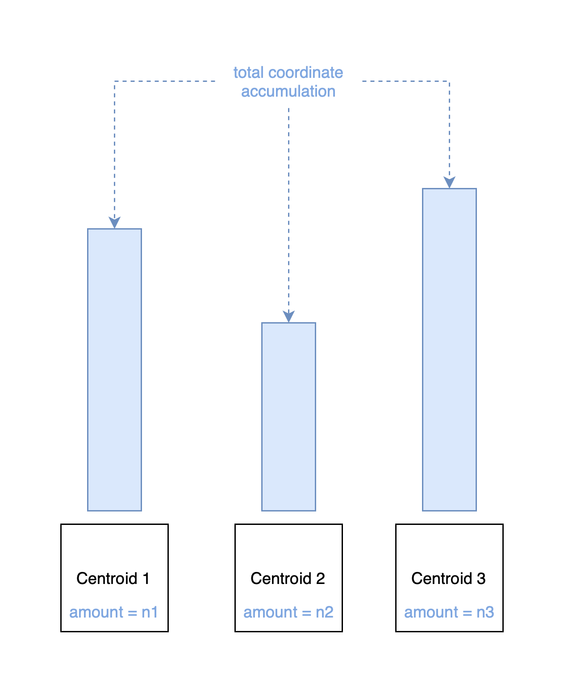
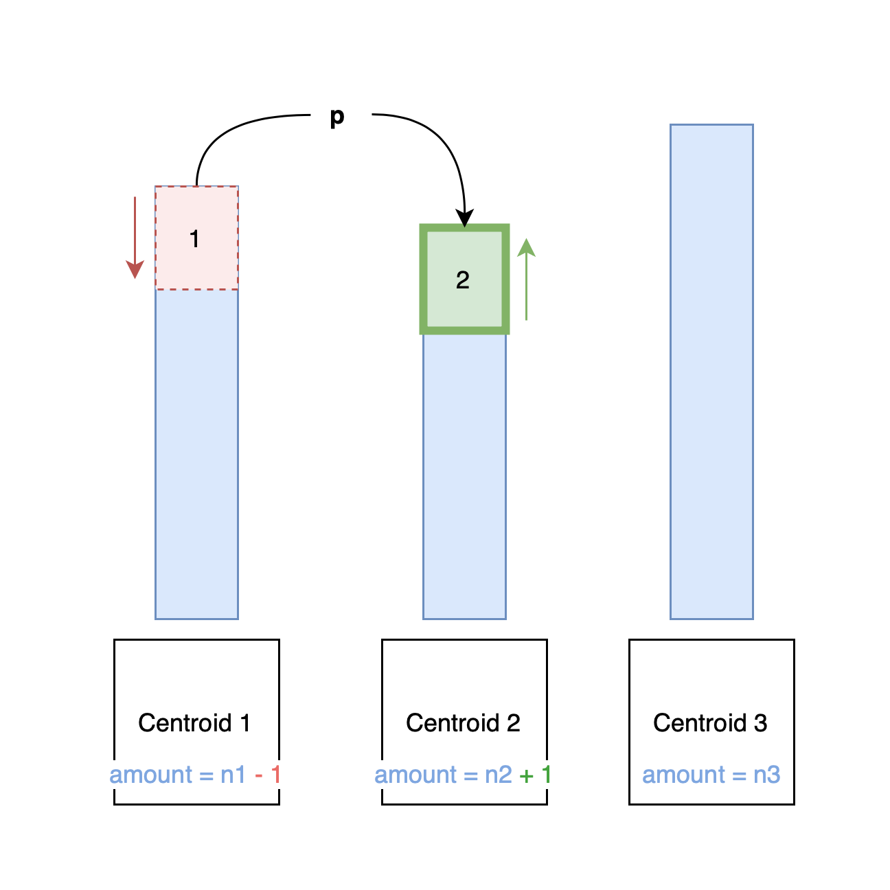

# INF-PDS-Project - KMeans Serieel - Yarne Dirkx & Maties Claesen

**1. Een versie die werkt**

Natuurlijk begin je altijd met het schrijven van een seriële versie die werkt. Hierbij hebben we ons sterk gebasseerd op de pseudo code die werd gegeven in de assignment. Hierbij valt natuurlijk niet veel te vermelden buiten het feit dat we dezelfde output krijgen als de referentie executable file geplaatst op het VSC.

Onze implementatie:
```
# Steps: 13,5,8,6,6,12,6,8,14,9
1,1,0,1,1,1,1,1,1,1,1,0,1,1,0,1,1,1,1,1,1,1,1,1,1,1,1,2,1,1,1,1,0,2,1,1,1,1,1,0,1,1,1,2,1,1,1,0,1,1,1,2,1,1,1,2,1,2,0,1,1,1,0,0,1,1,1,1,2,1,1,1,1,1,1,1,1,1,1,0,2,2,0,1,1,1,1,0,1,1,1,1,1,1,1,1,1,2,2,1,2,1,1,1,1,0,2,1,1,1,1,1,1,1,1,1,2,1,1,1,1,1,1,0,1,2,2,0,1,1,1,1,2,1,2,0,1,1,1,2,1,0,2,1,0,1,1,2,1,1,0,1,1,1,0,1,2,1,2,2,1,1,2,2,1,1,1,1,1,1,2,1,1,1,2,1,1,1,1,1,0,1,2,1,1,1,1,1,1,1,2,2,1,1,1,1,2,1,1,2,1,2,1,1,1,1,1,1,1,2,1,1,2,0,2,1,2,1,1,2,1,1,0,0,1,2,1,1,1,1,1,1,1,1,2,2,2,1,1,1,1,1,1,1,1,1,2,1,1,1,0,1,1,1,1,1,1,1,1,2,2,1,1,2,1,1,1,1,1,2,1,1,1,2,1,2,1,1,1,1,2,1,1,1,1,2,2,2,1,1,0,0,0,0,0,0,0,0,0,0,0,0,0,0,0,0,0,0,0,0,0,0,0,0,0,0,0,0,0,0,0,0,0,0,0,0,0,0,0,0,0,0,0,0,0,0,0,0,0,0,0,0,0,0,0,0,0,0,0,0,0,0,0,0,0,0,0,0,0,0,0,0,0,0,0,0,0,0,0,0,0,0,0,0,0,0,0,0,0,0,0,0,0,0,0,0,0,0,0,0,2,2,2,2,2,2,2,2,2,2,2,2,2,2,2,2,2,2,2,2,2,2,2,2,2,2,2,2,2,2,2,2,2,2,2,2,2,2,2,2,2,2,2,2,2,2,2,2,2,2,2,2,2,2,2,2,2,2,2,2,2,2,2,2,2,2,2,2,2,2,2,2,2,2,2,2,2,2,2,2,2,2,2,2,2,2,2,2,2,2,2,2,2,2,2,2,2,2,2,2,0,2,0,1,1,0,2,2,2,0
```
De referentie executable:
```
# Steps: 13,5,8,6,6,12,6,8,14,9
1,1,0,1,1,1,1,1,1,1,1,0,1,1,0,1,1,1,1,1,1,1,1,1,1,1,1,2,1,1,1,1,0,2,1,1,1,1,1,0,1,1,1,2,1,1,1,0,1,1,1,2,1,1,1,2,1,2,0,1,1,1,0,0,1,1,1,1,2,1,1,1,1,1,1,1,1,1,1,0,2,2,0,1,1,1,1,0,1,1,1,1,1,1,1,1,1,2,2,1,2,1,1,1,1,0,2,1,1,1,1,1,1,1,1,1,2,1,1,1,1,1,1,0,1,2,2,0,1,1,1,1,2,1,2,0,1,1,1,2,1,0,2,1,0,1,1,2,1,1,0,1,1,1,0,1,2,1,2,2,1,1,2,2,1,1,1,1,1,1,2,1,1,1,2,1,1,1,1,1,0,1,2,1,1,1,1,1,1,1,2,2,1,1,1,1,2,1,1,2,1,2,1,1,1,1,1,1,1,2,1,1,2,0,2,1,2,1,1,2,1,1,0,0,1,2,1,1,1,1,1,1,1,1,2,2,2,1,1,1,1,1,1,1,1,1,2,1,1,1,0,1,1,1,1,1,1,1,1,2,2,1,1,2,1,1,1,1,1,2,1,1,1,2,1,2,1,1,1,1,2,1,1,1,1,2,2,2,1,1,0,0,0,0,0,0,0,0,0,0,0,0,0,0,0,0,0,0,0,0,0,0,0,0,0,0,0,0,0,0,0,0,0,0,0,0,0,0,0,0,0,0,0,0,0,0,0,0,0,0,0,0,0,0,0,0,0,0,0,0,0,0,0,0,0,0,0,0,0,0,0,0,0,0,0,0,0,0,0,0,0,0,0,0,0,0,0,0,0,0,0,0,0,0,0,0,0,0,0,0,2,2,2,2,2,2,2,2,2,2,2,2,2,2,2,2,2,2,2,2,2,2,2,2,2,2,2,2,2,2,2,2,2,2,2,2,2,2,2,2,2,2,2,2,2,2,2,2,2,2,2,2,2,2,2,2,2,2,2,2,2,2,2,2,2,2,2,2,2,2,2,2,2,2,2,2,2,2,2,2,2,2,2,2,2,2,2,2,2,2,2,2,2,2,2,2,2,2,2,2,0,2,0,1,1,0,2,2,2,0
```

**2. Een geoptimaliseerdere versie**

Nadat we een werkende versie hadden zagen we dat we enkele optimalisaties konden doorvoeren zodat ons serieel programma als robuuste fundamentele code kon zorgen in vergelijking met de komende parallele programma's. Een van de problemen die we hier zagen was het feit dat we veel data initialiseerde en managede tijdens het berekenen van onze resultaten. Dit kan zorgen voor een grote impact in overhead tijdens het uitvoeren van ons programma. Daarom hadden we besloten om deze data **allemaal vooraf te initialiseren** voordat we beginnen met berekeningen. Dit wil zeggen dat we ook een **grote datastructuur bijhouden** (bv: een vector van vectors in plaats van in de for elke keer een nieuwe vector te maken). Dit geeft ons als voordeel dat we de overhead vooraf kunnen plaatsen waardoor deze in latere fases van het project gemakkelijker te onderscheiden zal zijn i.v.m. het bekijken van de uitvoertijd, enzovoort. Het tweede voordeel dat we hieruit kunnen halen is het feit dat we bij het overstappen naar een parallel programma, eigenlijk al een **shared resource** bevatten die we kunnen verdelen via een **SIMD strategy** over onze verschillende threads. Natuurlijk zijn er ook andere mogelijkheden zoals loop-level parallelisme die we in die fase van het project zullen vergelijken en uitproberen.

Door het feit dat we een nu een vector van vectors bijhouden kan het zijn dat de indexatie van deze matrix zeer traag kan verlopen. Hierdoor hebben we besloten om te gaan voor een aaneengesloten vector die we dan indexeren afhankelijk van de vaste `vector grootte * de huidige rij`. 

We wilden ook in principe de timer pas starten nadat we deze data hadden geinitialiseerd aangezien dit niet echt de berekeningen waren, toch hebben we bij nader inzien dit in de oplossing bewaart aangezien we de totale uitvoertijd moeten bekijken en dit ook expliciet wordt gevraagd in de opgave.

Andere optimalisaties die we in deze stap hebben toegevoegd zijn:
* zo veel mogelijk:
  * references
  * consts
* zo weinig mogelijk:
  * copy / move constructors
* kleinere bare bones structs die data managen

Daarbij hebben we ook enkele toevoegingen gemaakt zoals:
* duidelijke comments
* gebruik van launch.json en tasks.json in VSCode

*2.1. Mappenstructuur**

De verschillende pbs als uitvoer files staan in de map "FinalKmeans", deze werden uitgevoerd op het VSC met de finale code. De mappen "Output-and-error_debugging", "Csv-output_debugging" werden gebruikt tijdens het debuggen, hierin staan output files van mislukte pogingen.
In de map "Correct_debugging" staan de output files van de eerste werkende versie tijdens het debuggen.
"Greedy versie" en "Finale versie" bevatten de code voor beide versies van algoritmen.

**3. Een GREEDY algoritme**

Nadat we dit gedeelte werkende hadden bij ons programma hadden we besloten om eens te kijken in een abstracte vorm naar de mogelijke faalpunten van dit serieel programma. 

in de psuedo code zien we dus als volgt:
``` python =
...

1    def average_of_points_with_cluster(j):
2        for p in range(numberOfPoints):
3            if p in cluster j:
4                totalOfJ = p.coordinates
5                totalPointsInJ += 1
6       return totalOfJ.coordinates / totalPointsinJ

...

7   for p in range(numberOfPoints):
8       newCluster, dist = find_closest_centroid_index_and_distance(p, centroids)
9       distanceSquaredSum += dist
11
11      if newCluster != clusters[p]: 
12          clusters[p] = newCluster 
13          changed = True
14
15  if changed: # re-calculate the centroids based on current clustering 
16      for j in range(k):
17          centroids[j] = average_of_points_with_cluster(j)

...
```

We zien natuurlijk een probleem bij deze code wat waarschijnlijk een grote impact gaat hebben op de uitvoertijd. We lopen **twee keer** over de gehele range van punten. Wanneer we dan N punten hebben, hebben we tenminste 2*N nodig om dit programma uit te voeren. Dit is te zien op lijn 2 en lijn 7 waarbij elk `for p in range(numberOfPoints):` staat. Deze afschatting neemt dan ook nog niet in acht dat we bij lijn 16 `for j in range(k):` dit voor elke centroid moeten berekenen. Hierdoor zouden we dus bij de functie `average_of_points_with_cluster` meermaals over **alle** punten moeten lopen gewoon om het nieuwe gemiddelde te berekenen.

Om dit probleem op te lossen hadden we dus besloten om een extra serieële versie te maken die de pseudocode achterwege laat en dit probleem probeert op te lossen. 

**3.1. Een ordening invoegen**

was de lijst van clusters berekent op lijn 12, te ordenen. Hierbij zouden we een soort van insertion sort gebruiken die ervoor zorgt dat we bij lijn 2 niet meer door de gehele lijst van punten moeten lopen maar enkel door het subdeel dat behoort tot deze cluster. Hierdoor zouden we niet meer voor elke centroid door de gehele lijst moeten lopen maar enkele door elk punt nogmaals 1 keer. Deze oplossing leek ons nochtans tegenstrijdig met de huidige immplementatie aangezien we dan een andere manier moesten vinden om de clusters te linken aan de punten (doordat deze nu niet meer op de geassocieerde index staan). Hierbij zou dan ook het probleem zijn dat we weeral een grote lijst aan data moeten bijhouden tijdens het berekenen van ons programma. Natuurlijk is dit meestal de afweging, snellere uitvoertijd = meer data bijhouden (zodat je minder moet berekenen). 

Toch waren we opzoek naar een betere methode die ook minder data bij moest houden.

**3.2 Een GREEDY algoritme**

Na een uitgebreide brainstorm sessie hadden we een mogelijk alternatief gevonden dat ons probleem zeer efficient oploste en weinig data bijhield. We houden dan een kleine dictionary bij die elke cluster mapt op de totale afstand (berekent op lijn 8) en het totaal aantal elementen. We hadden ondervonden dat de code van lijn 7-13 waarschijnlijk niet weg te reduceren valt aangezien we in een zeer goed geval dan enkel lineair over onze lijst van punten moeten lopen. Toch hadden we ingezien dat de berekening van bij lijn 17 ook in deze eerste stap van het programma zou kunnen worden uitgevoerd.

``` python =

1 struct <double, int> pair
2
3    amount, totalP
5    increment(p)
6        amount += 1
7        totalP += p
8    
9    decrement(p)
10        if (amount >= 1)
11            amount -= 1
12            totalP -= p
13
...

14   dict<int, <double, int>> distanceDict # cluster <-> (total distances, total points in cluster)
15   for p in range(numberOfPoints):
16       newCluster, dist = find_closest_centroid_index_and_distance(p, centroids)
17       distanceSquaredSum += dist
18
19      if newCluster != clusters[p]: 
20          
21          if oldCluster >= 0: 
22              distanceDict.at(oldCluster).decrement(currentPoint)
23          distanceDict.at(newCluster).increment(currentPoint)
24
25          clusters[p] = newCluster
26          changed = True
27
28
29  if changed: # re-calculate the centroids based on current clustering 
30      for j in range(k):
31          centroids[j] = distanceDict.at(j).totalP / distanceDict.at(j).amount
...
```

**3.2.1 De eerste loop**

De eerste loop krijgen we gewoon een verzadeging van elke centroid in de dict. We krijgen dat iets zoals het onderstaande. 



Voor elke centroid zal dan de totale coordinaten van het punt totalP (gedefinieerd op lijn 3) accumeleren tot een bruikbare waarde.

Het interessante is natuurlijk de tweede stap namelijk wanneer er een punt migreerd van cluster oftewel centroid.

**3.2.2 Een migratie**



Enkel wanneer er dan een punt zich verplaats van cluster zal er een herberekening worden gedaan binnen de dict. Dit wil zeggen dat deze dict tijdens de gehele repetitions zal worden doorgegeven en aangepast als een shared resource. Dit zou in een parallel programma wel veel meer dependencies toevoegen waardoor we deze implementatie niet hebben gemerged met onze actuele implementatie. Toch kunnen we deze versie wel sterk gebruiken als competitie voor onze toekomstige code. 

Bij het berekenen van het gemiddelde wordt enkel amount gebruikt en de coordinaten opgeslaan in totalP om zo `distanceDict.at(j).totalP / distanceDict.at(j).amount` het gemiddelde te berekenen.
